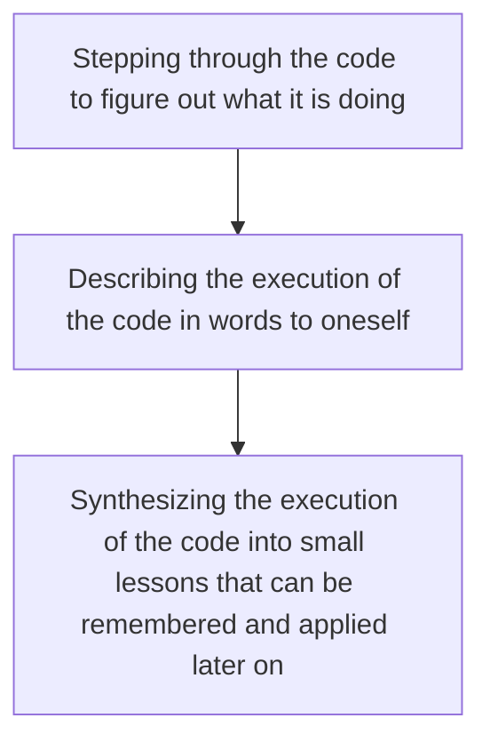

In any technical field, if you visit the online forums where most technical discussions are conducted, you will often find that the smartest, most helpful and well-intentioned individuals often struggle with communicating the right pieces of information, and using the right language in teaching the newly initiated. Often is the case where you observe the following in your interactions on forums like Math Overflow.

<div align="center">
    
</div>

Online Computer Science forums are much the same, especially when learning through sites like CodeForces or LeetCode. 

## Intuitive Solutions to Problems

From my personal experience teaching algorithms to students as a Teaching Assistant for [15-451 Algorithm Design and Analysis](https://www.cs.cmu.edu/afs/cs/Web/People/15451/index.html), I have developed an appreciation for solutions that are intuitive. These are solutions where reading the code highlights some fundamental concept that can be generalized well. If you think about the space of solutions as being a vector field, then the most intuitive solutions would form a projection into a smaller dimensional subspace for the space of solutions. 


The idea of intuitive, generalizable solutions is illustrated well with an example. Consider the LeetCode problem [Best Time to Buy and Sell Stock III](https://leetcode.com/problems/best-time-to-buy-and-sell-stock-iii/description/). The solution that I initially came up with made a lot of sense to me. I will now attempt to explain the thought process that I employed to come up with, in my opinion, a straightforward solution to this complex problem. 

## Best Time to Buy and Sell Stock III
The statement of the problem is as follows. There is an `N` dimensional array of integers called `prices`, where the entry `prices[i]` corresponds to the price of some stock at day `i`. We can buy and sell at most one unit of the stock at any day, with the restriction that we can hold at most one unit of the stock at any time. The problem asks us to find the maximum profits that we can make by buying the stock at a lower price and selling at a higher price, given that we can make at most _two transactions_ i.e. at most two pairs of buys and sells. I recommend to the patient reader to attempt to solve the problem on their own before reading on. 

If you are struggling with finding the solution, think about if you can reduce the problem to a similar problem acting on the array of successive price differentials. Maybe think about the problem when we can make at most _one transaction_ instead of two? 

## My Solution
My solution ot the problem came from the following realisation
> Given the array of successive price differentials i.e. `diffs = [prices[i + 1] - prices[i] for i in range(len(prices) - 1)]`, the profits made through a transaction is represented uniquely by a contiguous subsequence sum of the array `diff`. 

If the question instead asked us to find the maximum profit we can make via _one_ transaction, then we can simply find the maximum contiguous subsequence sum of the array using Kadane's algorithm. The formulation of Kadane's algorithm is as follows:

\\(\mathsf{prefixSum} \gets 0\;\\)

\\(\mathsf{minPrefixSum} \gets 0\;\\)

\\(\mathsf{maxContiguousSubsequenceSum} \gets 0\;\\)

For each \\(i \in [N - 1]\\):

\\(\quad \mathsf{prefixSum} \gets \mathsf{prefixSum} + \mathsf{diff}[i]\;\\)

\\(\quad \mathsf{minPrefixSum} \gets \min(\mathsf{prefixSum}, \mathsf{minPrefixSum})\;\\)

\\(\quad \mathsf{maxContiguousSubsequenceSum} \gets \max(\mathsf{maxContiguousSubsequenceSum}, \mathsf{prefixSum} - \mathsf{minPrefixSum})\;\\)

Observe that if the maximum contiguous subsequence sum is represented by \\(\mathsf{sum}(\mathsf{diff}[0:i]) - \mathsf{sum}(\mathsf{diff}[0:j])\\) for some \\(0 \leq i \leq j < N - 1\\), then note that it must be the case that \\(\mathsf{sum}(\mathsf{diff}[0:j])\\) is \\(\min_{j \in \\{0,1,...,i\\}} \left\\{\mathsf{sum}(\mathsf{diff}[0:j])\right\\}\\), since if that were not the case we can come up with a bigger subsequence sum by picking a \\(j\\) that makes \\(\mathsf{sum}(\mathsf{diff}[0:j])\\) smaller. Hence, iterating over all possible \\(i\\) and maintaining a minimum prefix sum and an overall prefix sum at each iteration allows us to check for all possible candidates for the maximum contiguous subsequence sum.

We need to now be able to generalize this solution to finding the maximum profits when we are allowed at most two transactions. We can make one further observation. 

> If we can make at most two transactions to make the maximum possible profits, then we need to find 
\\[\max_{i \in \\{0, 1, ..., N - 1 \\}} \left\\{\mathsf{mcss}(\mathsf{diffs}[0:i]) + \mathsf{mcss}(\mathsf{diffs}[i : N - 1])\right\\}\\]

Naively calling the \\(\mathsf{mcss}\\) method on each of the prefixes and suffixes at each iteration would lead to an \\(O(N^2)\\). In order to do better, we need to exploit the iterative nature of Kadane's algorithm. Observe that at iteration \\(i\\) of Kadane's algorithm, the variable \\(\mathsf{maxContiguousSubsequenceSum}\\) already stores the maximum contiguous subsequence sum for the prefix \\(\mathsf{diffs}[0:i]\\). We can simply populate an array \\(\mathsf{mcssPrefix}\\) with the values of \\(\mathsf{maxContiguousSubsequenceSum}\\) at each iteration. To create a similar array \\(\mathsf{mcssSuffix}\\), we can first reverse the array \\(\mathsf{diffs}\\), run the same algorithm for the prefix MCSS values, then reverse the final array \\(\mathsf{mcssSuffix}\\) again. This lends us to a clean \\(O(N)\\) solution. 

However, the final solution to the problem is not the important lesson that needs to be communicated to the learner. The more important lesson that needs to be taught is that sometimes, reductions to problems that you might have seen before are a powerful tool in abstracting away unnecessary details of the problem. If you are someone who is trying to help out struggling individuals on online forums, do not provide the solution as help, but rather try to walk through the important concepts that can aid the person in coming up with the solution themselves. Remember, people learn the most when they are able to come up with the details of the solution themselves with some guiding principles to aid them. 

Let us look at what ends up happening in the LeetCode discussion boards of the problem. 

## Problem Discussion Boards
Most of the solutions written on the discussion boards look like the following (mostly just code without much explanation):
```[Java]
// Buy and Sell Stock Pattern
// Approach - 1 Memorization


class Solution {
    public int maxProfit(int[] prices) {
        
        int n = prices.length;
        int [][][]dp = new int [n][2][3];
        for(int [][] i: dp){
            for(int [] j : i){
                Arrays.fill(j,-1);
            }
        }
        return solve(0,n,0,2,prices,dp);
    }
    int solve(int index, int n, int buy, int transaction, int [] prices, int [][][]dp){

        if(index==n|| transaction==0) return 0;

        if(dp[index][buy][transaction]!=-1) return dp[index][buy][transaction];

        int profit =0;
        if(buy ==0){
            profit = Math.max(0+ solve(index+1,n,0,transaction,prices,dp),
            -prices[index]+solve(index+1,n,1,transaction,prices,dp));
        }
        if(buy==1){
            profit = Math.max(0+solve(index+1,n,1,transaction,prices,dp),
            prices[index] + solve(index+1,n,0,transaction-1,prices,dp));
        }
        return dp[index][buy][transaction] = profit;
    }
}
```

A few points to note: 
1. There is no comments placed on the solve method that can let us figure out what the preconditions and postconditions on the method are, and what it is trying to do.
2. The code is written very hackily, and the time cost of trying to understand the code to figure out what it is trying to do is very high.
3. There does not seem to be any intuitive / generalizable idea that is being communicated through this solution. 

When solutions like this are posted on the internet by people who are trying to help, the burden falls on the students to figure out (a) what the code is doing, and (b) what compressed nuggets of information they can take away from this solution to apply to other problems. I argue that it would be more efficient to share little nudges instead of full solutions that guide people to writing the full solution themselves, or teaching concepts that can be applied to a whole range of problems. 


## Dynamic Programming Solution
Let us try to come up with the dynamic programming solution to this problem ourselves (which is the most valuable way to learn how to solve problems!). First, we observe that there are 5 states to this process that we might be in at any day \\(i\\), and those states are \\(\\{(B = 0, S = 0), (B = 1, S = 0), (B = 1, S = 1), (B = 2, S = 1), (B = 2, S = 2)\\}\\), where \\(B\\) represents the number of stocks bought, and \\(S\\) represents the number of stocks sold. 

Let us \\(1\\) index the array \\(\mathsf{prices}\\) for now. The dynamic programming solution \\(\mathsf{bestProfits}[i][\mathsf{state}]\\) can be formulated as
* If \\(i = 0\\), then \\(0\\) only in the state \\((B = 0, S = 0)\\), and in any other state \\(-\infty\\). 
* If \\(i > 0, \mathsf{state} = (B = 0, S = 0)\\), then \\(0\\)
* If \\(i > 0, \mathsf{state} = (B = k + 1, S = k)\\) for \\(k \in \\{0, 1\\}\\), then we note that we may have bought the new stock the day before, or we may have bought the share today, or sometime in the past, in which case our best profit would be \\(\max(-\mathsf{prices}[i] + \mathsf{bestProfits}[i - 1][(B = k, S = k)], \mathsf{bestProfits}[i - 1][(B = k + 1, S = k)])\\). 
* If \\(i > 0, \mathsf{state} = (B = k, S = k)\\), for \\(k \in \\{1, 2\\}\\), then note that we could have sold the stock today, or sometime before, in which case our profits would be
    \\(\max(\mathsf{prices}[i] + \mathsf{bestProfits}[i - 1][(B = k, S = k - 1)], \mathsf{bestProfits}[i - 1][(B = k, S = k)])\\)
* For all other states, the value should be \\(-\infty\\) since those states are illegal. 

Again, after having read the solution, we have to think to ourselves what the generalizable concept is, and for the dynamic programming approach applied to this problem the lesson should be that DP is a great technique to use if we know that we can be in a finite number of states at each iteration, and that the state at this iteration directly depends on the best solution to the problem in the iteration before for some other state. 

Note that for all illegal runs of the algorithm, the value that is stored in the dynamic programming array will always be \\(-\infty\\). Furthermore, note that any valid sequence of two transactions will be represented in this dynamic programming array since we consider all possible valid orderings for how to buy and sell at most two stocks. 

There are a few more considerations that we need to keep in mind in the style of delivery of teaching material for CS online. 

## Solutions with Code and Solutions with Prose
When parsing code, it is my belief that people go through the following stages. 

The time it takes to get from the first step to the second is often very large, often exacerbated by the hacky solutions that people respond on online forums such as LeetCode discussion boards with. Most people also conflate the ideas of "small solutions" with "clean solutions", and one must be wary that the two are not always the same. If you have ever ventured into code golfing competitions, you will quickly find that the smallest solutions are often the most difficult to make sense of. 

The way that this problem can be corrected is through biasing towards solutions based on prose instead of solutions based on actual code– the former makes it way easier and more approachable for newcomers to learn from. 

In the spirit of allowing the readers to come up with details of the solution themselves, it is additionally better to communicate the key ideas through prose so that the readers can come up with the programmatic details themselves. The joy of being able to discover parts of a solution by oneself makes it more likely that problem solving techniques are stored in long-term memory.

## On Proofs
The community online often seems averse to the ideas of learning from proving things rather than writing code. It must always be remembered that code without proof is as valuable as is gibberish. 

But, at the same time, it must be recognized that proving things is often much harder than coming up with a few examples of why something works. If you know why it is difficult to solve \(\mathsf{NP}\)-hard problems, then you will definitely be able to relate to this fact of nature. Furthermore, in some instances delivering the full proof in all its formal galores sometimes can intimidate students away from learning the material. 

So, I propose that proofs always convey the most important details, and as much as possible be incorporated in the explanation of the algorithm itself. Doing so makes it not only easier to read, but also helps students remember key details to apply later on.

## On the Efficacy of Learning Online for Free
Hopefully by now I have convinced you that in the space of free materials online that can teach you CS, there is clearly a gap in the market for content that can effectively teach students in this space. Clearly, there is a reason why tech companies still look to hire college graduates rather than self-taught individuals, since there definitely is an unquestionable value-add in a college taught CS curriculum. 

That being said, most content that is taught in universities is often available online, and is only a question of students who seek to learn to find them. For example, all the wonderful lecture notes from CMU's [15-451 Algorithm Design and Analysis](https://www.cs.cmu.edu/afs/cs/Web/People/15451/index.html) have been made available online for free.

